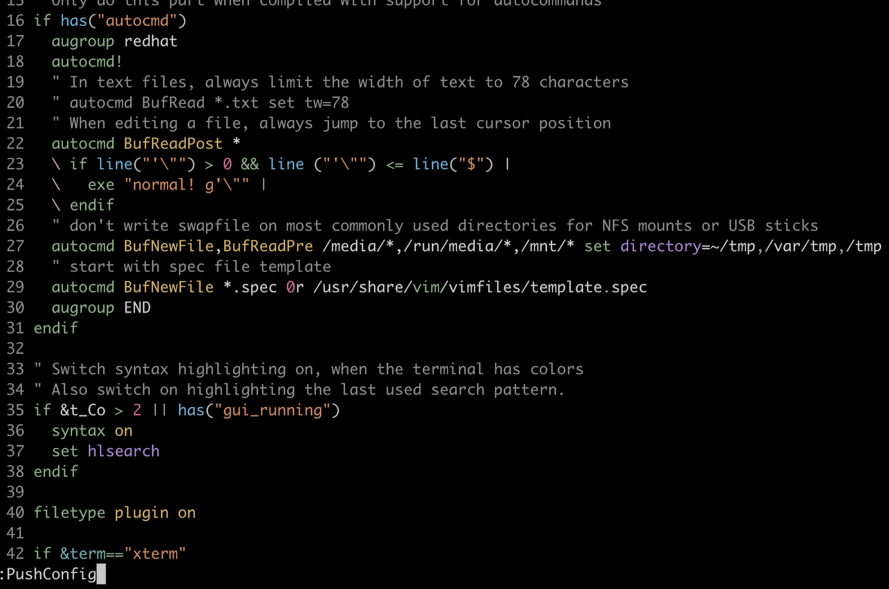

# EscSync
Sync any your configuration file to remote. Currently only support gist.

Gist: https://gist.github.com  
Generate github token: https://github.com/settings/tokens/new

## Install

### vim-plug
```vim
Plug 'Me1onRind/EscSync'
```

## Example

### Use EscSync sync .vimrc
Edit ~/.vimrc.
```vim
let g:esc_sync_github_token = "ghp_xxxxxxxxxxxxxxxxxx"
let g:esc_sync_gist_id = "8b3b26ebe17149d54487a3xxxxxxxxxx"
" let g:esc_sync_backup = 0
let g:esc_sync_files = {
    \ "~/.vimrc": {"remote_filename": ".vimrc"},
    \ "/private/tmp/text": {"remote_filename": "testfile"},
\ }
```
If you don't want to save your token in .vimrc, you can set it by environment variable.
```shell
EXPORT ESC_SYNC_GITHUB_TOKEN = "ghp_xxxxxxxxxxxxxxxxxx"
```


When you push or pull, you must use Vim to open the target file.  
Create or update ~/.vimrc.




Sync ~/.vimrc form remote.


